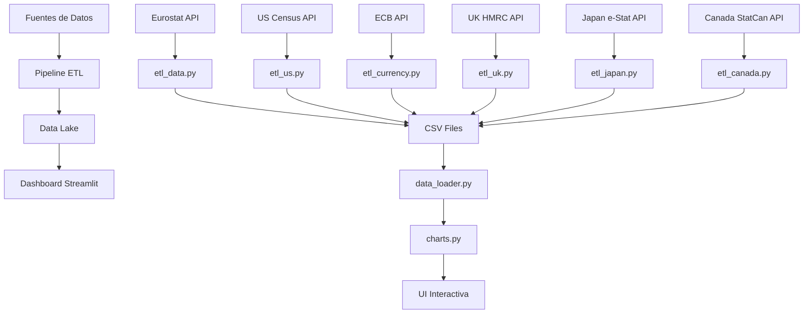

<div align="center">

# 📊 Widget Meteoconomics

### Dashboard de Análisis de Comercio Internacional

---

[](https://www.python.org/) [](https://streamlit.io/) []() []()

**🌐 Demo en vivo:** https://widget-meteo.streamlit.app/

---

</div>

## 📋 Resumen Ejecutivo

Dashboard interactivo desarrollado como Trabajo Fin de Máster para el análisis y visualización de datos de comercio internacional. El proyecto integra datos oficiales de múltiples fuentes (Eurostat, US Census Bureau, ECB) en una plataforma unificada que permite analizar 23 años de historia comercial con más de 14,600 registros mensuales.

### 🎯 Objetivos del Proyecto

- **Integración de datos**: Unificar múltiples fuentes oficiales de comercio internacional
- **Automatización ETL**: Desarrollar pipelines de extracción, transformación y carga
- **Visualización interactiva**: Crear dashboard intuitivo para análisis temporal y sectorial
- **Análisis comparativo**: Facilitar el estudio de patrones comerciales entre países

### ✨ Características Principales

- 🔄 Sistema ETL automatizado con actualización incremental
- 📈 Visualizaciones interactivas con Plotly
- 🏭 Análisis por sectores SITC (10 categorías)
- 🌍 Comercio bilateral con principales socios
- 💱 Conversión automática de divisas (EUR/USD)
- 📦 Arquitectura modular y extensible

---

## 📚 Tabla de Contenidos

- [Datos y Fuentes](#-datos-y-fuentes)
- [Arquitectura del Proyecto](#-arquitectura-del-proyecto)
- [Instalación](#-instalación)
- [Uso](#-uso)
- [Metodología ETL](#-metodología-etl)
- [Resultados](#-resultados)
- [Tecnologías](#-tecnologías)

---

## 📊 Datos y Fuentes

### Cobertura de Datos

| País | Fuente Oficial | Periodo | Registros |
|------|----------------|---------|-----------|
| 🇩🇪 Alemania | Eurostat DS-059331 | 2002-2025 | ~3,148 |
| 🇪🇸 España | Eurostat DS-059331 | 2002-2025 | ~3,148 |
| 🇫🇷 Francia | Eurostat DS-059331 | 2002-2025 | ~3,148 |
| 🇮🇹 Italia | Eurostat DS-059331 | 2002-2025 | ~3,148 |
| 🇺🇸 Estados Unidos | US Census Bureau | 2010-2025 | ~2,101 |

**📈 Total**: ~14,696 registros mensuales | **🔄 Última actualización**: Febrero 2026

### Fuentes de Datos Oficiales

<details>
<summary><b>Eurostat - Statistical Office of the European Union</b></summary>

- **Dataset**: DS-059331 - International Trade in Goods
- **Clasificación**: SITC Rev. 4 (Standard International Trade Classification)
- **Moneda**: EUR
- **Frecuencia**: Mensual
- **URL**: https://ec.europa.eu/eurostat

</details>

<details>
<summary><b>US Census Bureau</b></summary>

- **API**: Time Series International Trade
- **Endpoints**: `/exports/sitc` y `/imports/sitc`
- **Clasificación**: SITC Rev. 4
- **Moneda**: USD
- **Frecuencia**: Mensual
- **API Key**: Requerida (gratuita)

</details>

<details>
<summary><b>European Central Bank (ECB)</b></summary>

- **Servicio**: Statistical Data Warehouse
- **Pares de divisas**: EUR/USD, EUR/GBP, EUR/JPY, EUR/CAD
- **Frecuencia**: Diaria
- **Propósito**: Normalización monetaria entre fuentes

</details>

### Clasificación SITC Rev. 4

El proyecto utiliza la clasificación estándar de la ONU para comercio internacional:

| Código | Sector | Código | Sector |
|--------|--------|--------|--------|
| 0 | Alimentos y animales vivos | 5 | Productos químicos |
| 1 | Bebidas y tabaco | 6 | Manufacturas por material |
| 2 | Materiales crudos | 7 | Maquinaria y transporte |
| 3 | Combustibles minerales | 8 | Manufacturas diversas |
| 4 | Aceites y grasas | 9 | Otros |

**TOTAL**: Agregado de todos los sectores

---

## 🏗️ Arquitectura del Proyecto

### Estructura de Directorios

```
Widget_Meteoconomics_Master/
├── 📱 widget_meteoconomics.py    # Aplicación principal Streamlit
├── 🔄 update_all_data.py         # Orquestador de ETLs
├── 📋 requirements.txt           # Dependencias
│
├── 📊 src/                       # Módulos del dashboard
│   ├── charts.py                 # Visualizaciones Plotly
│   ├── config.py                 # Configuración y constantes
│   ├── data_loader.py            # Carga y transformación
│   └── utils.py                  # Funciones auxiliares
│
├── 🔧 etl/                       # Pipeline ETL
│   ├── etl_data.py               # ETL Eurostat (UE)
│   ├── etl_us.py                 # ETL US Census Bureau
│   ├── etl_uk.py                 # ETL UK HMRC
│   ├── etl_japan.py              # ETL Japan e-Stat
│   ├── etl_canada.py             # ETL Canada StatCan
│   └── etl_currency.py           # ETL tasas de cambio ECB
│
└── 💾 data/                      # Datos persistentes
    ├── eu/                       # Datos Unión Europea
    │   ├── bienes_agregado.csv
    │   └── comercio_socios.csv
    ├── us/                       # Datos Estados Unidos
    │   ├── bienes_agregado.csv
    │   └── comercio_socios.csv
    └── exchange_rates.csv        # Tasas de cambio
```

### Arquitectura de Componentes



### Descripción de Módulos

| Módulo | Funcionalidad |
|--------|---------------|
| `widget_meteoconomics.py` | Interfaz principal del dashboard |
| `src/charts.py` | Generación de gráficos interactivos |
| `src/data_loader.py` | Carga, filtrado y preparación de datos |
| `src/config.py` | Variables globales y mapeos |
| `etl/etl_data.py` | Extracción de datos Eurostat |
| `etl/etl_us.py` | Extracción de datos US Census |
| `etl/etl_uk.py` | Extracción de datos UK HMRC |
| `etl/etl_japan.py` | Extracción de datos Japan e-Stat |
| `etl/etl_canada.py` | Extracción de datos Canada StatCan |
| `etl/etl_currency.py` | Extracción de tasas de cambio |

---

## 🚀 Instalación

### Requisitos Previos

- Python 3.8 o superior
- pip (gestor de paquetes)
- Git

### Pasos de Instalación

```bash
# 1. Clonar el repositorio
git clone https://github.com/jaimeberdejo/Widget_Meteoconomics_Master.git
cd Widget_Meteoconomics_Master

# 2. Crear entorno virtual (recomendado)
python3 -m venv venv
source venv/bin/activate  # Windows: venv\Scripts\activate

# 3. Instalar dependencias
pip install -r requirements.txt

# 4. (Opcional) Configurar API Key para datos US
export CENSUS_API_KEY='tu_api_key'
# Obtener en: https://api.census.gov/data/key_signup.html
```

---

## 💻 Uso

### Ejecutar el Dashboard

```bash
streamlit run widget_meteoconomics.py
```

El dashboard estará disponible en `http://localhost:8501`

### Funcionalidades del Dashboard

| Característica | Descripción |
|----------------|-------------|
| 🌍 **Selección de país** | Alemania, España, Francia, Italia, EE.UU. |
| 📅 **Filtrado temporal** | Rango de fechas personalizable |
| 🏭 **Análisis sectorial** | Desglose por 10 sectores SITC |
| 🤝 **Comercio bilateral** | Principales socios comerciales |
| 💱 **Conversión de divisas** | Visualización en EUR o USD |
| 📥 **Exportación** | Descarga de datos en CSV |

### Actualizar Datos

```bash
# Actualización incremental (solo datos nuevos)
python3 update_all_data.py

# Descarga completa del histórico
python3 update_all_data.py --force
```

---

## 🔄 Metodología ETL

### Pipeline de Datos

1. **Extracción (Extract)**
   - Conexión a APIs oficiales (Eurostat, US Census, ECB)
   - Descarga incremental desde última fecha disponible
   - Manejo de errores y reintentos automáticos

2. **Transformación (Transform)**
   - Normalización de formatos de fecha
   - Estandarización de códigos de país (ISO 3166-1)
   - Mapeo de sectores SITC
   - Conversión de tipos de datos
   - Limpieza de valores nulos

3. **Carga (Load)**
   - Persistencia en formato CSV
   - Actualización incremental (append)
   - Validación de integridad

### Estructura de Datos de Salida

**bienes_agregado.csv** (~14,696 registros)

| Campo | Tipo | Descripción |
|-------|------|-------------|
| `fecha` | date | Fecha del registro (YYYY-MM-DD) |
| `pais` | string | Nombre del país |
| `pais_code` | string | Código ISO 3166-1 alpha-2 |
| `sector` | string | Nombre del sector SITC |
| `sector_code` | string | Código SITC (0-9, TOTAL) |
| `exportaciones` | float | Valor exportaciones (millones) |
| `importaciones` | float | Valor importaciones (millones) |
| `balance` | float | Balanza comercial |
| `moneda_original` | string | Divisa (EUR/USD) |

**comercio_socios.csv**

Comercio bilateral desagregado por país socio comercial.

**exchange_rates.csv**

Tasas de cambio diarias ECB para normalización monetaria.

---

## 📈 Resultados

### Métricas del Proyecto

| Métrica | Valor |
|---------|-------|
| **Registros totales** | 14,696 |
| **Países analizados** | 5 |
| **Años de histórico** | 23 (2002-2025) |
| **Sectores SITC** | 10 + TOTAL |
| **Fuentes integradas** | 3 |
| **Formato de salida** | CSV normalizado |

### Rendimiento

| Operación | Tiempo |
|-----------|--------|
| Carga inicial dashboard | ~2.5s |
| ETL incremental | 1-2 min |
| ETL completo | 10-15 min |
| Filtrado interactivo | <0.1s |

### Optimizaciones Implementadas

- ✅ Caché de datos con Streamlit `@st.cache_data`
- ✅ ETL incremental para minimizar descargas
- ✅ Procesamiento vectorizado con Pandas
- ✅ Visualizaciones WebGL con Plotly

---

## 🛠️ Tecnologías

### Stack Tecnológico

| Tecnología | Versión | Propósito |
|------------|---------|-----------|
| **Python** | 3.8+ | Lenguaje principal |
| **Streamlit** | 1.28+ | Framework web interactivo |
| **Pandas** | 2.0+ | Procesamiento de datos |
| **Plotly** | 5.17+ | Visualizaciones interactivas |
| **Requests** | 2.31+ | Cliente HTTP para APIs |

### Dependencias Completas

```txt
streamlit>=1.28.0
pandas>=2.0.0
plotly>=5.17.0
requests>=2.31.0
```

---

<div align="center">

**Widget Meteoconomics** | Febrero 2026

*Dashboard de Análisis de Comercio Internacional*

</div>
